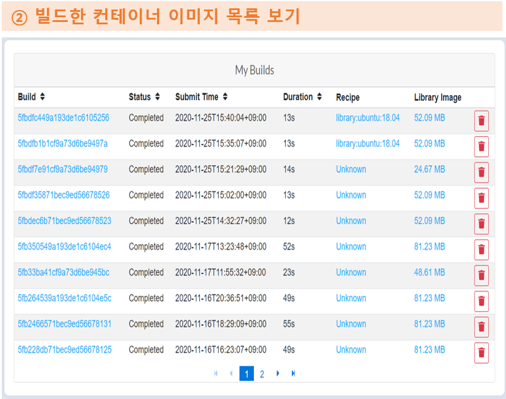

# How to Use Singularity Container

Similar to Docker, Singularity is a container platform suitable for implementing OS virtualization in high-performance computing environments. It creates a container image that contains Linux distribution, compiler, library, application, etc., which are suitable for the user work environment. In addition, Singularity runs the container to execute the user program.

Container images that support deep learning frameworks, such as TensorFlow, Caffe, and PyTorch, can be accessed from /apps/applications/singularity\_images and /apps/applications/singularity\_images/ngc directories.


## A. Load the Singularity Module or Set the Path

```
$ module load singularity/3.6.4 (3.1.0)
or
$ $HOME/.bash_profile
export PATH=$PATH:/apps/applications/singularity/3.6.4/bin/
```

## B. Run a Shell from the Singularity Container

```
$ singularity shell [shell options...]  

[Example]
## Run a shell from the Singularity container of the compute node equipped with Nvidia GPU’s 
singularity shell --nv＊ tensorflow:20.09-tf1-py3.sif
```

_※ Run “singularity help \<command> \[\<sub-command>]” to view help for a Singularity command \[shell | exec | run | pull ...]._\
_\* ) The --nv option must be adopted to use an Nvidia GPU on the compute/login node._

## C. Execute a User Program that Employs GPUs in the Singularity Container

```
$ singularity exec [exec options...]  execution command

[Example]
singularity exec --nv tensorflow:20.09-tf1-py3.sif python test.py
singularity exec --nv docker://tensorflow/tensorflow:latest python test.py
singularity exec --nv library://dxtr/default/hpc-tensorflow:0.1 python test.py

## If a runscript (/singularity, created when the image is generated) exists in the container, this script is run automatically. If parameters are specified, these parameters are regarded as the input parameters of the runscript.
$ singularity run [run options...] 

[Example]
$ singularity run --nv /apps/applications/singularity_images/ngc/tensorflow:20.09-tf1-py3.sif python --version

================
== TensorFlow ==
================

NVIDIA Release 20.09-tf1 (build 16003718)
TensorFlow Version 1.15.3

Container image Copyright (c) 2020, NVIDIA CORPORATION. All rights reserved.
Copyright 2017-2020 The TensorFlow Authors. All rights reserved.

NVIDIA Deep Learning Profiler (dlprof) Copyright (c) 2020, NVIDIA CORPORATION. All rights reserved.

Various files include modifications (c) NVIDIA CORPORATION. All rights reserved.
NVIDIA modifications are covered by the license terms that apply to the underlying project or file.

NOTE: Legacy NVIDIA Driver detected. Compatibility mode ENABLED.

Detected MOFED 4.4-2.0.7.

Python 3.6.9
```

_※ Refer to the writing a job script file> for information on how to run the container on the compute node using a scheduler (SLURM)._\


## D. How to Execute User Program From an Nvidia GPU Cloud (NGC) Container Based on the Module (Lmod)

```
## Automatically run the Singularity container image that supports TensorFlow 1.15.4 (tensorflow:20.09-tf1-py3.sif) to execute the user program
 $ module load singularity/3.6.4 ngc/tensorflow:20.09-tf1-py3
 $ mpirun -H gpu39:2,gpu44:2 –n 4 python $Base/horovod/examples/keras/keras_imagenet_resnet50.py

## Automatically run the Singularity container image that supports lammps (lammps:15Jun2020-x86_64.sif) to execute lammps
 $ module load singularity/3.6.4 ngc/lammps:15Jun2020
 $ mpirun –H gpu39:2,gpu44:2 -n 4 lmp -in in.lj.txt -var x 8 -var y 8 -var z 8 -k on g 2 -sf kk -pk kokkos cuda/aware \
 on neigh full comm device binsize 2.8

## Automatically run the Singularity container image that supports gromacs (gromacs:2020.2-x86_64.sif) to execute gromacs
 $ module load singularity/3.6.4 ngc/gromacs:2020.2
 $ gmx mdrun -ntmpi 2 -nb gpu -ntomp 1 -pin on -v -noconfout -nsteps 5000 –s topol.tpr singularity shell --nv＊ tensorflow:20.09-tf1-py3.sif
```

※ To use the Lmod-based NGC container-related modules, create an .lmod file in the user home directory (/home01/ID) by running the "touch .lmod" command, and then log in again.

※ The “singularity run --nv ” is automatically run by simply entering the execution command after loading the container image module.

_※_ NGC container module list

| Module name                  | Container image file that is run | Main components of the container image |
| ---------------------------- | -------------------------------- | -------------------------------------- |
| ngc/tensorflow:20.09-tf1-py3 | tensorflow:20.09-tf1-py3.sif     | TensorFlow 1.15.3, Horovod 0.19.1      |
| ngc/tensorflow:20.09-tf2-py3 | tensorflow:20.09-tf2-py3.sif     | TensorFlow 2.3.0, Horovod 0.19.5       |
| ngc/pytorch:20.12-py3        | pytorch:20.09-py3.sif            | PyTorch 1.7.0a0+7036e91                |
| ngc/caffe:20.03-py3          | caffe:20.03-py3.sif              | NVCaffe 0.17.3, OpenMPI 3.1.4          |
| ngc/gromacs:2020.2           | gromacs:2020.2-x86\_64.sif       | GROMACS 2020.2                         |
| ngc/lammps:29Oct2020         | lammps:29Oct2020-x86\_64.sif     | LAMMPS 29 Oct 2020                     |
| ngc/qe:6.7                   | quantum\_espresso:v6.7.sif       | quantum\_espresso v6.7                 |
| ngc/paraview:5.9.0-py3       | paraview\_egl-py3-5.9.0.sif      | Paraview 5.9.0                         |

_▸ Container image file path: /apps/applications/singularity\_images/ngc_\
_▸ Convert a Docker container image, which was optimized for the Nvidia GPU, built and distributed from NGC (_[_https://ngc.nvidia.com_](https://ngc.nvidia.com/)_) into a Singularity container image_

_※ How to install packages such as Python package, which are not provided by TensorFlow, the PyTorch container image, in the user home directory (Example)_

```
 ## The container image file can be modified with the user privilege. Hence, the Python package is installed in the user home directory, where the user has access privilege.
 $ module load ngc/tensorflow:20.09-tf1-py3 (Load a TensorFlow container module)
 $ pip install —user keras==2.1.2 (pip install —user [Python package name/version], installed in the /home01/ID/.local directory)
 $ pip list —user
 Package Version
 ----------- -------
 Keras 2.1.2

 $ module load ngc/pytorch:20.09-py3 (Load a PyTorch container module)
 $ pip install —user horovod (pip install —user [Python package name/version], installed in the /home01/ID/.local directory)
 $ pip list —user
 Package Version
 ----------- -------
 horovod 0.21.3

 $ module load ngc/pytorch:20.09-py3 (Load a PyTorch container module)
 $ conda install —use-local matplotlib -y (conda install —use-local [package name/version], installed in the /home01/ID/.conda/pkgs directory)
 $ conda list matplotlib
 # Name Version Build Channel
 matplotlib 3.3.3 pypi_0 pypi
```

## E. Build a Singularity Container Image as a User Without the Root Privilege

```
(Local build)
## Build ubuntu1.sif image from the recipe file
$ singularity build --fakeroot ubuntu1.sif ubuntu.def 
## Build ubuntu2.sif image from the Singularity library
$ singularity build --fakeroot ubuntu2.sif library://ubuntu:18.04 
## Build sandbox directory (ubuntu3) from a Docker hub
$ singularity build --fakeroot --sandbox ubuntu3 docker://ubuntu:18.04 
```

※ Supports version 3.6.4; the use of fakeroot needs to be registered by the administrator via the KISTI Homepage > Technical Support > Request a Support.

※ However, root privilege is required to modify the created Singularity image file (\*.sif). Furthermore, it is needed to change to sandbox (writable chroot directory).

```
(ubuntu.def recipe file example)
bootstrap: library
from: ubuntu:18.04
%post
apt update
%runscript
echo "hello world from ubuntu container!"
```

```
(Remote build)
## Build ubuntu4.sif image from the recipe file using the remote build service provided by the Sylabs Cloud
$ singularity build --remote ubuntu4.sif ubuntu.def 
```

※ Access token needs to be created and registered in the Neuron system to adopt the remote build service provided by the Sylabs Cloud (https://cloud.sylabs.io). \[Reference 1]

※ In addition, Singularity container images can be created and managed by accessing the Sylabs Cloud using a web browser. \[Reference 2]

## F. Pull/Push Singularity Container Image

```
 $ singularity pull tensorflow.sif library://dxtr/default/hpc-tensorflow:0.1 (Pull a container image from the Sylabs cloud library)
 $ singularity pull tensorflow.sif docker://tensorflow/tensorflow:latest (Pull an image from the Docker hub and convert it to a Singularity image)
 $ singularity push -U tensorflow.sif library://ID/default/tensorflow.sif (Push a Singularity image to the Sylabs Cloud library (upload))
```

_※ Access token needs to be created and registered in the Neuron system to push a container image to the Sylabs Cloud library (upload). \[Reference 1]_

_※ Singularity container images can be created and managed by accessing the Sylabs Cloud using a web browser. \[Reference 2]_

**\[Reference 1] Create Sylabs Cloud Access Token and Register It in the Neuron System**


웹 브라우저 : Web Browser\
①Sylabs Cloud 계정 등록 및 로그인하기 : Register Sylabs Cloud Account and Log In


②새로운 토큰 생성하기 : Create a New Token


③클립보드로 토큰 복사하기 : Copy the Token to the Clipboard


④토큰 입력하기 : Enter The Token

**\[Reference 2] Build a Singularity Container with the Remote Builder from a Web Browser**


①웹 브라우저에서 컨테이너 이미지 빌드하기 : Build a container image from a web brower



②빌드한 컨테이너 이미지 목록 보기 :View the list ofcontainer images thathave been built


2021년 12월 14일에 마지막으로 업데이트되었습니다.

