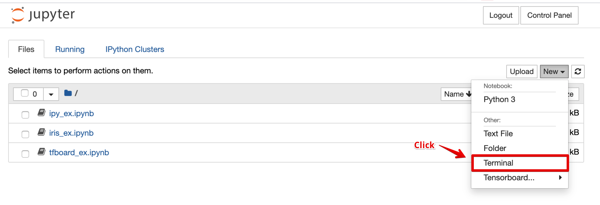
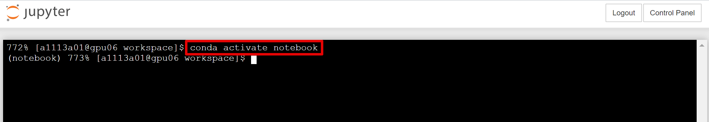
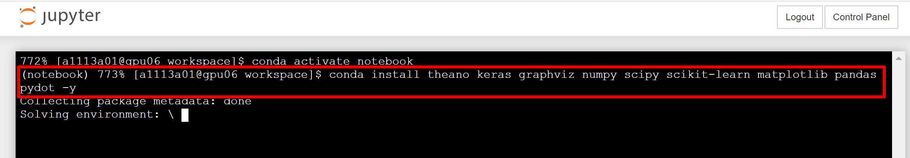
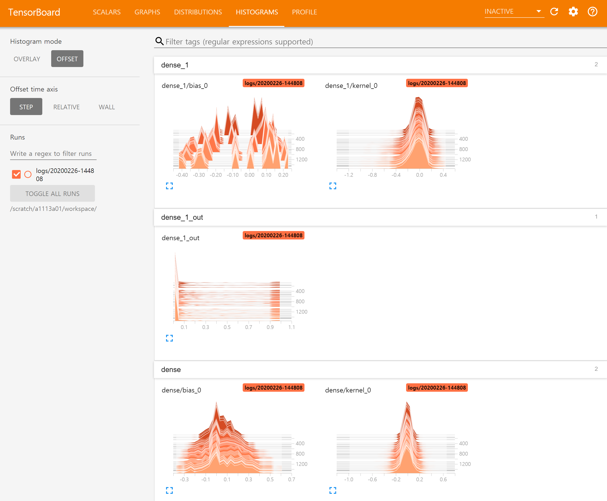
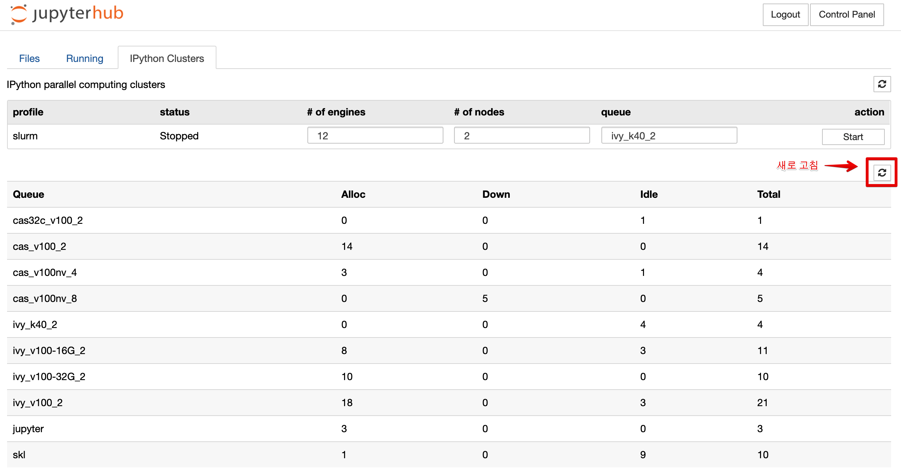
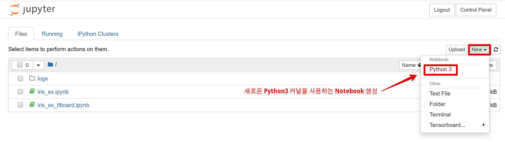
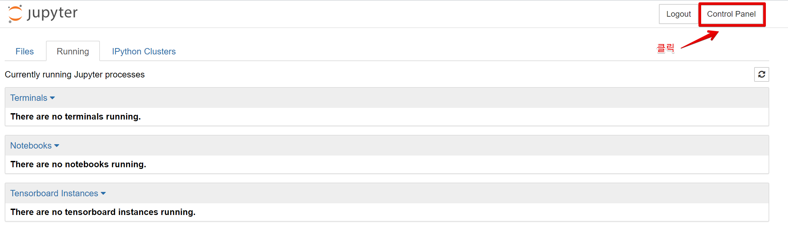
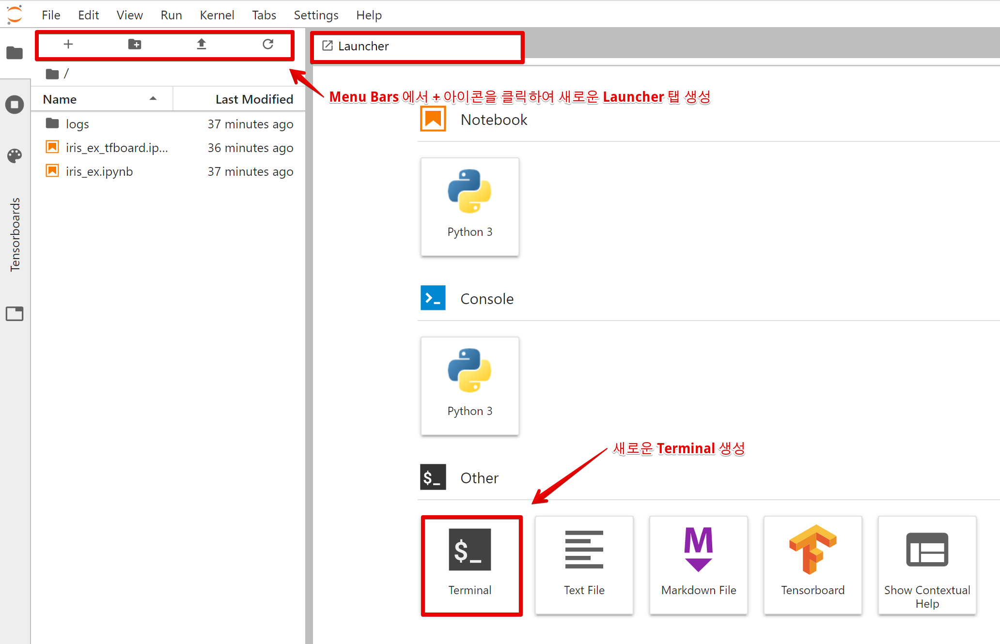
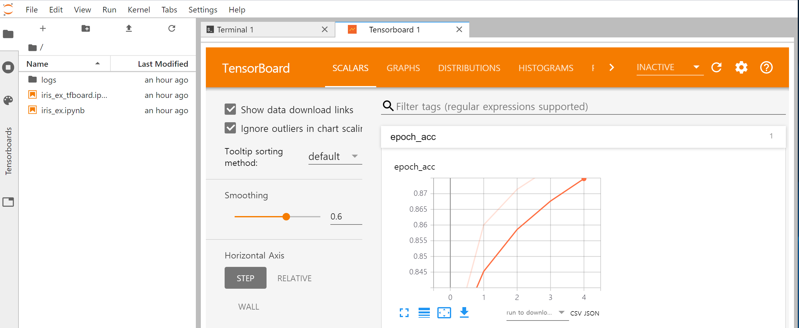

# Neuron Jupyter User Guideline

## 1. Overview of Jupyter

**A. JupyterHub**

○ JupyterHub is an open-source software that enables users to use JupyterLab and Jupyter Notebook in a multi-user environment.\
○ In addition to supporting various environments (JupyterLab, Notebook, RStudio, Nteract, etc.), JupyterHub can be flexibly integrated with authentication servers (OAuth, LDAP, GitHub, etc.) and batch schedulers (PBSPro, Slurm, LSF, etc.).\
○ In addition, JupyterHub can be easily integrated with Kubernetes, a container management platform; hence, it can also be easily linked with a container-based cloud environment.

※ The Neuron-based JupyterHub has added Unit #5 Bright LDAP and OTP authentication functions and integrates with a Slurm batch scheduler to allocate resources that run Jupyter. Currently, it provides Jupyter Notebook by default, including JupyterLab.

**B. Jupyter Notebook**

○ Jupyter Notebook is a web-based open-source application that programmers use for document creation, code creation and execution, data visualization using mathematical libraries, statistical modeling, and machine learning/deep learning programming.\
○ Jupyter Notebook supports approximately 40 programming languages, including Python, R, Julia, and Scala.\
○ Codes written in programming languages can be converted into various file types, such as HTML, image, video, and LaTeX.\
○ Jupyter Notebook can be integrated with various tools and libraries, such as Apache Spark, Pandas, Scikit-learn, ggplot2, and TensorFlow.


**C. JupyterLab**

○ JupyterLab comprises extensible modules by introducing functions to the Jupyter Notebook interface for user convenience.\
○ Unlike Jupyter Notebook, JupyterLab provides several documents or different functions on a single work screen using Tabs and Splitters.


**D. IPyParallel**

○ IPyParallel project is a Python module for interactive cluster computing that provides an interactive Python parallel environment.\
○ IPyParallel can be extended as a plug-in to Jupyter Notebook and used as an IPython Clusters Tab with a Jupyter Notebook.


## 2. Run Jupyter through a Script


<mark style="color:red;">**※ Run the script only once the first time. Once the environment is set, you can immediately connect to the webpage (refer to B. Connect to the JupyterHub webpage) and use JupyterLab and Jupyter Notebook.**</mark>

**1. Run the script**

\
\- Connect to the login node (<mark style="color:red;">**neuron.ksc.re.kr**</mark>) via a terminal and run the /apps/jupyter/kisti\_conda\_jupyter.sh script.\
\- While running the script, the Notebook conda environment is created in the <mark style="color:red;">**/scratch/\[user ID]/.conda/envs**</mark> directory. In addition, JupyterHub, JupyterLab, Jupyter Notebook, TensorFlow, and IPyParallel packages are automatically installed, while cudatoolkit 10.0 and cudnn, which are required for a multiple GPU environment, are installed (this takes approximately 8 min).

\
**※ This file needs to be run just once. You can then immediately connect to the webpage and use JupyterLab and Jupyter Notebook.**\
※ Executable files can be run from the shared directory using the /apps/jupyter/kisti\_conda\_jupyter.sh script.\
※ User ID <mark style="color:red;">**a1113a01**</mark> was adopted in the following test.

```
[a1113a01@glogin02 ~]$ sh /apps/jupyter/kisti_conda_jupyter.sh
 ... ...
 modified /home01/a1113a01/.bashrc
 ...prepare conda environment for jupyter user.
 Exporting CONDA ENVS and PKGS PATH to bash File.
 Downloading and Extracting Packages
 #################################################################### | 100%
 #################################################################### | 100%
 #################################################################### | 100%
 #################################################################### | 100%
 Preparing transaction: done
 Verifying transaction: done
 Executing transaction: / WARNING conda.core.prefix_data:_load_single_record(167):
 Ignoring malformed prefix record at:
 /scratch/a1113a01/.conda/envs/notebook/conda-meta/001.pycurl-7.43.0.5-py37h16ce93b_0.json
 done
```


\- Restart the shell and turn off the function that automatically activates the base environment. (Run only once)

```
[a1113a01@glogin01 ~]$ source ~/.bashrc
 (base) [a1113a01@glogin01 ~]$ conda config --set auto_activate_base false
 (base) [a1113a01@glogin01 ~]$ conda deactivate
```

※ Set the function that automatically activates the base environment to false prevent the automatic activation of the base environment next time. (If the base environment is not activated, run the conda activate notebook command right after source \~/.bashrc.)


\- Activate the conda notebook using the following command.

```
[a1113a01@glogin01 ~]$ conda activate notebook
 (notebook) [a1113a01@glogin01 ~]$
```


\- Users who want to employ Tensorboard and IPyParallel must install the tensorboard and ipyparallel extension packages for Jupyter Notebook/JupyterLab before connecting to the webpage. These packages can be installed by running the automated installation script /apps/jupyter/kisti\_conda\_plugins.sh provided by KISTI (this takes approximately 5 min).

※ Caution: The action must be executed from a notebook user environment.

```
(notebook) 757% [a1113a01@glogin01 ~]$ sh /apps/jupyter/kisti_conda_plugins.sh
 Installing /scratch/a1113a01/.conda/envs/notebook/lib/python3.7/site-packages/ipyparallel/nbextension/static -> ipyparallel
 Up to date: /scratch/a1113a01/.conda/envs/notebook/share/jupyter/nbextensions/ipyparallel/clusterlist.css
 Up to date: /scratch/a1113a01/.conda/envs/notebook/share/jupyter/nbextensions/ipyparallel/clusterlist.js
 Up to date: /scratch/a1113a01/.conda/envs/notebook/share/jupyter/nbextensions/ipyparallel/main.js
 - Validating: OK
To initialize this nbextension in the browser every time the notebook (or other app) loads:
 
 jupyter nbextension enable ipyparallel --py --sys-prefix
 
 Enabling tree extension ipyparallel/main...
 - Validating: OK
 Enabling: ipyparallel.nbextension
 - Writing config: /scratch/a1113a01/.conda/envs/notebook/etc/jupyter
 - Validating...
 ipyparallel.nbextension OK
 [ProfileCreate] Generating default config file: '/home01/a1113a01/.ipython/profile_slurm/ipython_config.py'
 [ProfileCreate] Generating default config file: '/home01/a1113a01/.ipython/profile_slurm/ipython_kernel_config.py'
 [ProfileCreate] Generating default config file: '/home01/a1113a01/.ipython/profile_slurm/ipcontroller_config.py'
 [ProfileCreate] Generating default config file: '/home01/a1113a01/.ipython/profile_slurm/ipengine_config.py'
 [ProfileCreate] Generating default config file: '/home01/a1113a01/.ipython/profile_slurm/ipcluster_config.py'
```

※ Henceforth, users can directly access the webpage and use Jupyter Notebook. (The tasks up to this point only need to be run once.)

****

**B. Connect to the JupyterHub webpage**\
\- Connect to [<mark style="color:red;">**https://jupyter.ksc.re.kr**</mark>](https://jupyter.ksc.re.kr/) and enter your Neuron account username, OTP, and password.


\- You can check the resource usage status on the main page and click the Refresh button to update the resource usage status.

**C. Select a queue and run Jupyter**

\
\- Click the <mark style="color:red;">**Refresh**</mark> button before running Jupyter to check the resource status\
◦ Alloc: Number of nodes being used\
◦ Idle: Number of available nodes\
◦ Down: Number of unavailable nodes\
◦ Total: Total number of nodes


\
\- Check the queue information\
&#x20; ****  ◦ jupyter queue (free): for installing the environment, preprocessing, and debugging\
&#x20; ◦ other queues (for a fee): for executing deep learning/machine learning models and visualization


※ The jupyter queue currently has 3 nodes and can run up to 30 Jupyter Notebooks (one Jupyter per user). Although it can perform visualization and model execution, its resources are provided for free; consequently, delays occur as more users are connected to the system.\
※ In addition to the jupyter queue, other queues exclusively use 1 node to run Jupyter Notebook; hence, the GPU resources of the node can be maximally used. (Refer to the table regarding the fees for using the Neuron system)\
※ The charging policy follows the existing charging policy for the Neuron system; the charge information can be found on the fee guide page of the National Supercomputing website ([**https://www.ksc.re.kr/jwjg/gjbg/ygan**](https://www.ksc.re.kr/jwjg/gjbg/ygan)).


\- Select the jupyter queue from the “Select a job” queue dropdown menu and click the Submit button to run Jupyter Notebook. (Although Jupyter Notebook can be run with other queues, additional fees are charged. Refer to the fee information about the Neuron system on the KSC Homepage.)


\- The following screen is displayed for a few seconds, and resources are allocated.

 선택 및 Jupyter 실행(1).png>)

\- The https://jupyter.ksc.re.kr/user/a1113a01/tree Jupyter Notebook screen is displayed by default.

 선택 및 Jupyter 실행(2).png>)



## 3. How to Use Jupyter Notebook

**A. Jupyter work environment**

<mark style="color:red;">**◦ Jupyter environment directory: /scratch/\[user ID]/.conda/envs/notebook**</mark>\ <mark style="color:red;"></mark><mark style="color:red;">**◦ Directory where logs are saved: /scratch/\[user ID]/log/job ID.log**</mark>\ <mark style="color:red;"></mark><mark style="color:red;">**◦ Directory where job files are saved: /scratch/\[user ID]/workspace/**</mark>

<mark style="color:red;">****</mark>

※ Users install machine learning/deep learning libraries they need in the .../notebook conda environment. Therefore, these libraries are installed in the /scratch/user ID/ directory, which has a large default quota. (Log files that are generated after running Jupyter are also saved in the /scratch/user ID directory.)\
※ Codes written by the user are saved in the /scratch/user ID/ directory.\
※ Information on exporting and importing a conda environment for backing up a conda environment can be found in the software guidelines on the KISTI homepage.


**B. How to use Jupyter Notebook**

\- The Menu Bar comprises Files, Running, and IPython Clusters tabs.


\- The Menu Bar -> Running tab can monitor and delete sessions (Terminal, Notebook, and Tensorboard) that are running currently.

.png>)

\- The Menu Bar -> IPython Clusters tab can start and end a profile-based Python parallel engine. (Refer to D. Running IPyParallel on how to create IPython parallel profiles.)


좌측 탭 스크롤 -> 뉴론(Neuron) -> 스케줄러(SLURM)를 통한 작업 실행: Scroll the left tab -> Neuron -> Run the job via the scheduler (SLURM)

.png>)

\- You can create a new Python3/Text File/Folder/Terminal/Tensorboard by clicking the “New” button.


**C. How to switch to JupyterLab**

\
\- You can switch from Jupyter Notebook to JupyterLab by changing “tree” to “lab” at the end of the address in the web browser, as illustrated below.\
\- Notebook screen https://jupyter.ksc.re.kr/user/a1113a01/tree

\- JupyterLab screen [https://jupyter.ksc.re.kr/user/a1113a01/lab](https://jupyter.ksc.re.kr/user/a1113a01/lab)


※ Refer to Supplement 1 for detailed information on how to use JupyterLab.


## 4. Execute the Machine Learning/Deep Learning Example Code

**A. Install libraries that are necessary to execute the example code**

****

\- Click New->Terminal and install libraries that are required for machine learning/deep learning.



\- Run the conda activate notebook command from the terminal environment to activate the notebook environment and install libraries that are required for the notebook environment.\
※ The libraries must be installed in the notebook conda environment to apply them to the Jupyter web screen.



\- Install the machine learning/deep learning-related libraries requested by the user in the notebook environment (This example shows the process of installing commonly used libraries, such as machine learning framework Keras, pandas, NumPy, and SciPy, using conda. It takes approximately 7 min to install the necessary libraries for this example.)

```
772% [a1113a01@gpu06 workspace]$ conda activate notebook
 (notebook) 773% [a1113a01@gpu06 workspace]$ conda install theano keras graphviz numpy scipy scikit-learn matplotlib pandas pydot -y
```




\- Verify the installation


**B. Create and execute an example code**

\
\- Return to the Homepage and click the iris\_ex.ipynb example file from the Menu Bar-> Files tab.


\- Jupyter Notebook is run, and the example code is executed using Shift + Enter.


※ You can ignore the warnings that are displayed during the execution process. If the same code is run again, these warning messages disappear. (The warnings provide syntax guidance for coding according to the version.)


**관련 패키지 설치 후 예제 코드 실행 가능: You can run the example code after installing the relevant packages**

****

\- Plot graphs using the matplotlib library


**C. Run Tensorboard**

\
\- Click tfboard\_ex.ipynb on the Menu Bar -> Files tab.


\- Execute the code using Shifter + Enter. (this takes approximately 1 min)


\- Run Tensorboard, and then click Home Page->New->Tensorboard->Current directory.\
※ The “logs” folder is created in Files, and the log data is saved in this folder.


※ Or click the “logs” folder, and then the Tensorboard button after the button is created.


\- TensorBoard -> Scalars


\- TensorBoard -> Graphs


\- TensorBoard -> Distributions


\- TensorBoard -> Histograms



**D. Run IPyParallel**

\
\- Click the IPython Clusters tab in the Menu Bar.


\- Enter the engine, node, and queue information in the slurm profile.\
engine: number of parallel processes\
node: number of compute nodes to be allocated\
queue: name of the queue to which the parallel job will be submitted (Select after checking the resource status below.)\
자원 현황: Resource status


\- Create the parallel engine by clicking the Start button, and then check the resource status by clicking the refresh button.



**E. Run the IPyParallel example code**

\
\- Click the Menu Bar -> Files -> ipy\_ex.ipynb.


**병렬 프로세스 개수 확인: Check the number of parallel processes**

**F. Create a new Launcher and write a Python code**

\
\- You can write a new Python code by clicking the New -> Python 3 menu, as shown below.



**새로운 Python3 커널을 사용하는 Notebook 생성: Create a new Notebook that employs the Python 3 kernel**

\- A new Jupyter Notebook Launcher that can adopt the Python 3 kernel is executed.


## 5. How to Stop Jupyter

**1. Terminate running sessions**

\- As illustrated in the following figure, click the Shutdown button in the Running tab to terminate the running Terminal, Kernel, or Tensorboard sessions.


※ If you close the JupyterHub webpage without terminating the sessions, these sessions will still remain the next time you run the Jupyter. (Fees are not charged in the meantime)

**2. Close Jupyter**

\
\- Click the (Jupyter Notebook) Control Panel -> Stop My Server.




<mark style="color:red;">**※ When you log out of the homepage, all running Jupyter and sessions are automatically closed.**</mark>

## 6. Jupyter Environment Initialization Method

※ If you install packages with pip in the conda virtual environment notebook, and a version conflict occurs with the packages that were previously installed using conda install, such that the Jupyter notebook fails to execute, use the following command to initialize the environment.

\- Run the /apps/jupyter/reset\_env.sh script from the login node terminal.

\- After running this script, all packages installed in the notebook virtual environment, which were created in the /scratch/\[user ID]/.conda/envs directory, are deleted, and the basic packages for running Jupyter for the first time are reinstalled.

\- The data in the /scratch/\[user ID]/workspace/ directory are preserved.

```
[a1113a01@glogin02 ~]$ sh /apps/jupyter/reset_env.sh
Remove all packages in environment /scratch/a1113a01/.conda/envs/notebook:
Preparing transaction: done
Verifying transaction: done
Executing transaction: / WARNING conda.core.prefix_data:_load_single_record(167): Ignoring malformed prefix record at: /scratch/acnta03/.conda/envs/notebook/conda-meta/001.pysocks-1.7.1-py37hc8dfbb8_1.json
done

One more step left, please execute these commands !!!!!!!
1. conda activate notebook
2. sh /apps/jupyter/kisti_conda_plugins.sh

[a1113a01@glogin02 ~]$ conda activate notebook
(notebook) [a1113a01@glogin02 ~]$ sh /apps/jupyter/kisti_conda_plugins.sh
```

\- Connect to the https://jupyter.ksc.re.kr homepage and check whether Jupyter is executing and working properly.



## \[Supplement 1]

**A. Switch from Jupyter Notebook to JupyterLab**

\
\- Modify the web address in the web browser from https://jupyter.ksc.re.kr/user/a1113a01/tree

to https://jupyter.ksc.re.kr/user/a1113a01/lab, and go to the new webpage.

\- Click the Terminal icon in the Launcher tab to run a Terminal.\
※ If the Launcher tab is not visible, click the + icon in the Menu Bar.




\- Click the Menu Bars->+ icon ->Launcher->Tensorboard icon to execute Tensorboard.




**B. Terminate Running Sessions**

\- As illustrated in the following figure, click the Session tab in the Left Side Bar, and then click the Shutdown button for the running Terminal or Kernel sessions to terminate the sessions.

※ If you close the JupyterHub webpage without terminating the sessions, these sessions will still remain the next time you run the Jupyter. (fees are not charged in the meantime)


**C. Close Jupyter**

\- (JupyterLab) When your use for Jupyter is over, you are required to close it to return the resources. To return the resources, click File -> Hub Control Panel to go to the Homepage, and then click the “Stop My Server” button.





2021년 12월 2일에 마지막으로 업데이트되었습니다.

